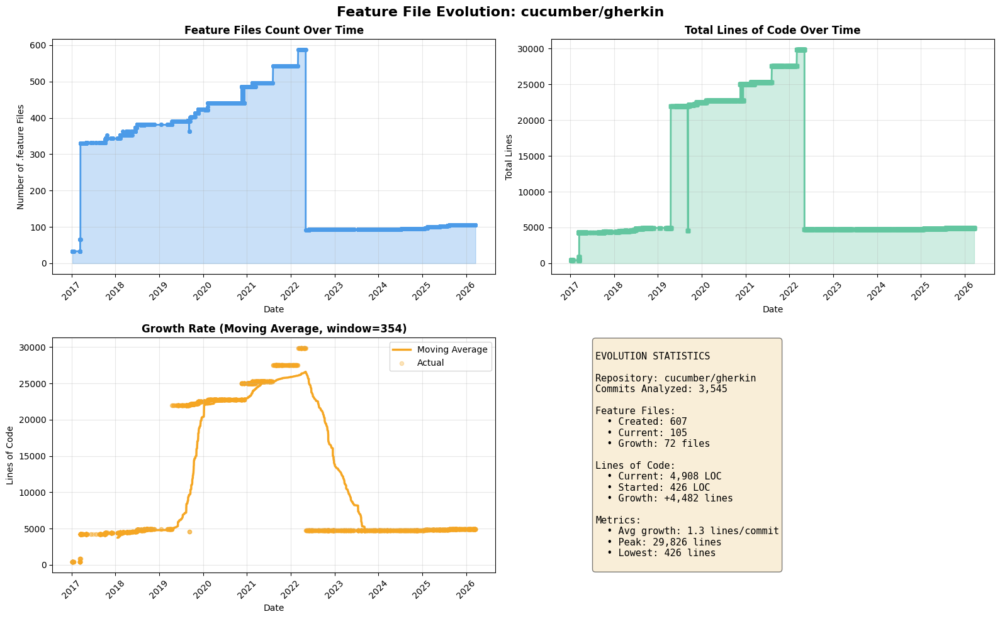
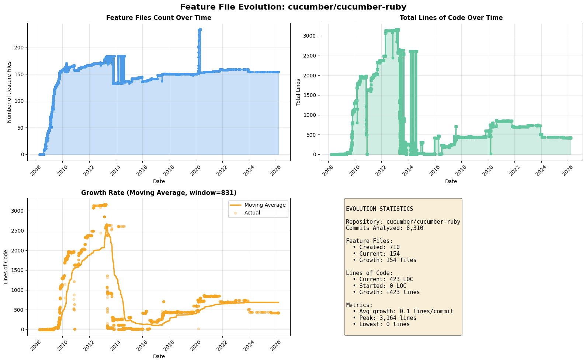

# Feature Evolution Analyzer

Analyzes how `.feature` files evolved over time in GitHub repositories using git history and commit analysis.

## Features

- ✅ Tracks feature file creation, modification, deletion
- ✅ Generates commit-by-commit timeline reports (CSV)
- ✅ Creates growth visualizations (PNG charts)
- ✅ Calculates statistical metrics
- ✅ Batch processes multiple repositories
- ✅ Handles 1000s of commits efficiently

## Installation

```bash
pip install -r requirements.txt
```

## Quick Start

Analyze a single repository:
```bash
python3 feature_evolution_analyzer.py "behave/behave"
python3 feature_evolution_analyzer.py "https://github.com/cucumber/gherkin"
```

Batch analyze:
```bash
python3 batch_analysis.py --repos behave/behave cucumber/gherkin
```

## Output Files

- `evolution_timeline.csv` - Commit-by-commit timeline
- `evolution_stats.json` - Statistical summary
- `file_timeline.csv` - Individual file history
- `evolution_visualization.png` - Growth charts

## Sample Results

### cucumber/gherkin (3,545 commits)
| Metric | Value |
|--------|-------|
| Feature Files Created | 607 |
| Current Files | 105 |
| Lines of Code | 4,908 |
| Total Growth | +4,482 lines |
| Date Range | 2017-01-08 to 2026-03-20 |
| Avg Growth | 1.26 lines/commit |



### cucumber/cucumber-ruby (8,310 commits)
| Metric | Value |
|--------|-------|
| Feature Files Created | 710 |
| Current Files | 154 |
| Lines of Code | 423 |
| Total Growth | +423 lines |
| Date Range | 2008-04-09 to 2026-03-18 |
| Avg Growth | 0.05 lines/commit |



## Project Structure

```
.
├── feature_evolution_analyzer.py   # Main analyzer class
├── batch_analysis.py               # Batch processor
├── examples.py                     # Usage examples
├── requirements.txt                # Dependencies
├── bdd_repositories.txt           # Sample repos
├── run_analysis.sh                # Quick script
├── run_batch.sh                   # Batch script
├── evolution_analysis*/           # Sample results
└── README.md                      # This file
```

## Requirements

- Python 3.7+
- GitPython
- pandas
- matplotlib
- tqdm
- numpy

## License

MIT
